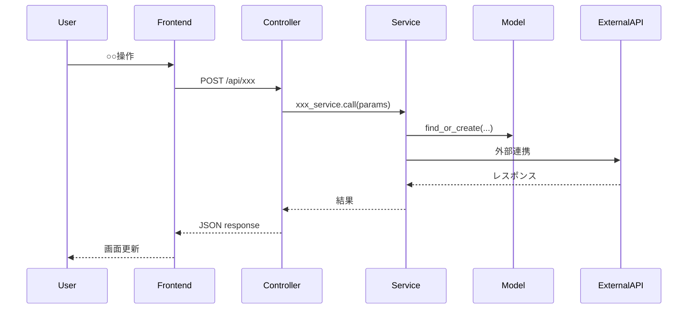

# PR Review Assist

PRの差分を読み解き、**理解 → 判断 → 指摘** のサイクルを高速に回すためのスキル。

前提知識が薄い領域のPRでも、レビュアーが「自分の言葉で説明できる」レベルまで
短時間で到達できることをゴールとする。

---

## 実行フロー

### Step 1: PR情報の取得

ユーザーからPR番号またはブランチ名を受け取ったら、以下を実行する。

```bash
# PR概要の取得
gh pr view <PR番号> --json title,body,baseRefName,headRefName,files,additions,deletions,author

# 差分の取得
gh pr diff <PR番号>

# PRに紐づくコメント・レビューコメントの取得（既存の議論を把握するため）
gh pr view <PR番号> --json comments,reviews
```

PR番号が不明な場合は `gh pr list` で一覧を出し、ユーザーに確認する。

### Step 2: 高度からの俯瞰（Bird's Eye View）

最初に全体像を把握する。ここが最も重要なステップ。
差分全体を読み、以下の構造で**日本語で**整理する。

```markdown
## 🎯 このPRの目的

（1〜2文で、「何を」「なぜ」変更しているかを端的に述べる）

## 📋 変更の概要

| カテゴリ | ファイル | 変更内容 |
|---------|--------|---------|
| （例: API追加） | `app/controllers/xxx.rb` | ○○エンドポイントの新規追加 |
| （例: DB変更） | `db/migrate/xxx.rb` | ○○テーブルにカラム追加 |
| ... | ... | ... |

## 🔄 変更の依存関係

変更ファイル間の依存関係を簡潔に説明する。
「このファイルの変更は、あのファイルの変更を前提としている」という関係性。
```

ポイント：
- ファイル名をただ並べるのではなく、**変更の意図ごとにグルーピング**する
- 「なぜこの変更が必要か」というビジネス上・技術上の背景を推測して補足する
- PRのdescriptionやコミットメッセージから読み取れる情報を最大限活用する

### Step 3: 技術要素・ドメイン知識の噛み砕き

差分に登場する技術要素やドメイン知識のうち、レビュアーが知らない可能性があるものを抽出し、
**簡潔に、しかし正確に**解説する。

```markdown
## 📚 前提知識ガイド

### 技術キーワード
- **〇〇パターン**: （1〜2文で何をするパターンか。なぜここで使われているか）
- **△△ gem/ライブラリ**: （何をするものか。このPRでどう使われているか）

### ドメイン知識
- **〇〇（業務用語）**: （ビジネス上の意味と、コード上でどう表現されているか）
```

ここで重要なのは：
- 「知っている人には不要、知らない人には必須」という粒度を狙う
- 各用語は**このPRの文脈でどう関係しているか**まで述べる（辞書的な定義だけでは不十分）
- フレームワーク固有のDSLや規約（例: Railsのcallback、Reactのhooksルール）にも言及する

### Step 4: 処理フローの可視化

変更の中心となるロジックについて、Mermaidシーケンス図を生成する。

目的は「脳内メモリの節約」。図があれば、メソッド間の呼び出し関係を頭の中で
保持し続ける必要がなくなる。

```markdown
## 🔀 処理フロー

### メインフロー

```

図を作る際のルール：
- 参加者（participant）は実際のクラス名・モジュール名を使う
- メッセージは実際のメソッド名を含める（`user_service.create(params)` のように）
- 分岐やエラーケースがある場合は `alt` / `opt` ブロックで表現する
- 図が複雑になりすぎる場合は、メインフローとサブフローに分割する
- フロントエンドとバックエンドの境界を明確にする

### Step 5: レビュー観点の整理と指摘

理解が深まった段階で、具体的なレビューを行う。

```markdown
## 🔍 レビュー所見

### ❗ 要確認（対応推奨）
1. **[ファイル名:行番号] 指摘タイトル**
   - 問題: 何が問題か
   - 理由: なぜ問題か（技術的根拠）
   - 提案: どう直すべきか

### ⚠️ 気になる点（議論の余地あり）
1. **[ファイル名:行番号] 指摘タイトル**
   - 懸念: 何が気になるか
   - 背景: なぜ気になるか

### ✅ 良い点
- （良い実装や改善点を具体的に挙げる）

### 📊 総合判断
（Approve / Request Changes / Comment の推奨と、その根拠を1〜2文で）
```

レビュー観点のチェックリスト（内部的に使う。全項目を機械的に列挙する必要はない）：
- **正確性**: ロジックにバグや抜け漏れがないか
- **セキュリティ**: 認証・認可の漏れ、SQLインジェクション、XSSなどの脆弱性
- **パフォーマンス**: N+1クエリ、不要なループ、インデックス不足
- **エラーハンドリング**: 異常系の処理が適切か
- **テスト**: 変更に対するテストが十分か、テストの質は適切か
- **命名・可読性**: 意図が伝わる命名か、複雑なロジックにコメントがあるか
- **設計**: 責務の分離、DRY原則、適切な抽象度
- **互換性**: 既存機能への影響、マイグレーションの安全性
- **ドメイン整合性**: ビジネスルールとの整合性

---

## 出力のスピードについて

このスキルの価値は「理解速度の向上」にある。そのため：

- 全ステップを一気に出力する（ステップごとに確認を挟まない）
- 不要に長い説明は避ける。各セクションは必要十分な長さにとどめる
- 図はメインフロー1つ + 必要に応じてサブフロー1〜2つまでに絞る
- 明らかに問題ないファイル（テストの追加のみ、設定ファイルの微修正など）は概要テーブルで触れるだけで深堀りしない

---

## 追加コマンド

ユーザーが追加で求める可能性のあるアクション：

- **「もっと詳しく」**（特定ファイルやメソッドの深堀り）→ 該当箇所のコードを`gh`やローカルファイルから取得し、行単位で解説
- **「この部分のテスト観点は？」** → 該当ロジックに対するテストケースの提案
- **「レビューコメントを書いて」** → GitHub上に投稿できる形式でコメント文面を生成
- **「関連コードを見せて」** → 差分に含まれないが関連する既存コードを探索し提示

---

## 注意事項

- PRの差分が500行を超える場合は、変更の意図ごとにチャンクに分けて処理する
- 差分だけでは判断できない場合（既存コードの文脈が必要な場合）は、
  ローカルのファイルを直接読んで補完する
- 推測で判断せず、確信が持てない箇所は「確認が必要」と明示する
- ドメイン知識が不足している場合は、正直にその旨を伝え、
  ユーザーに補足を求める
